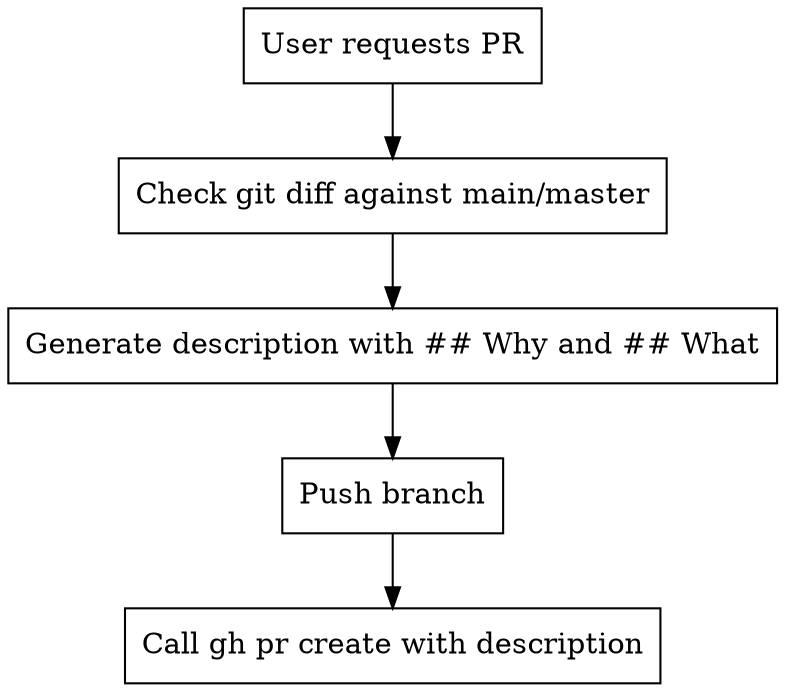

# Creating Pull Requests

## Overview

Generate standardized PR descriptions by analyzing git diff, then create PRs with `gh pr create`.

## When to Use

**Use when user says:**
- "Create a PR"
- "Open a pull request"
- "Make a PR for this"
- Any variation requesting PR creation

## Workflow



## Implementation

### Step 1: Generate Description

**Process:**
1. Check the diff of this branch against master/main
2. Identify what has changed between the two
3. Create a summary of what changed and why we changed it
4. Make it succinct as if another developer is reading it for review
5. Use the headings `## Why` and `## What`
6. Depth should be medium at best - quick to read but gives adequate explanation

**Format:**
```markdown
# Recommended Title

## Why

[Explain the problem or motivation - why this change was needed]

## What

[Describe the changes made - what was done to address the why]

{{Special notes if applicable - deployment steps, breaking changes, etc.}}
```

**Check the diff:**
```bash
# See changes against main/master
git diff main...HEAD
# or
git diff master...HEAD
```

### Step 2: Push Branch

```bash
git push -u origin <branch-name>
```

### Step 3: Create PR

```bash
gh pr create \
  --title "Title from generated description" \
  --body "$(cat <<'EOF'
<paste generated description here>
EOF
)" \
  --assignee @me \
  --reviewer <team-name>
```

## Complete Example

```bash
# User: "Create a PR and assign team my-org/my-team for review"

# Step 1: Check the diff
git diff master...HEAD

# Review changes and generate description:
# - What changed: Added _handle_reassignment() method, updated deletion logic
# - Why it changed: Fix bug where policies weren't reassigned on deletion

# Step 2: Push
git push -u origin fix-policy-reassignment

# Step 3: Create PR with generated description
gh pr create \
  --title "Fix: Add policy reassignment when deleting approval policies" \
  --body "$(cat <<'EOF'
## Why

When an approval policy is deleted, related policies were not being reassigned to the default policy. This caused issues with downstream workflows after policy deletion.

## What

- Added `_handle_reassignment()` method to reassign related policies
- Updated `delete()` method to call reassignment logic
- Added tests for policy reassignment on deletion

EOF
)" \
  --assignee @me \
  --reviewer my-org/my-team
```

## Common Mistakes

| Mistake | Fix |
|---------|-----|
| Not checking git diff first | Always review `git diff main...HEAD` before writing |
| Missing ## Why section | Always explain the problem or motivation |
| Missing ## What section | Always describe what changed |
| Vague descriptions | Be specific - mention methods, files, changes |
| Using --body with inline text | Use heredoc (cat <<'EOF') for multiline descriptions |
| Forgetting to push branch first | Always push before gh pr create |
| Wrong diff range | Use `main...HEAD` not `main..HEAD` (three dots, not two) |

## Why This Matters

- **Consistency**: All PRs follow same ## Why / ## What format
- **Quality**: Reviewers understand motivation before diving into code
- **Efficiency**: Clear descriptions speed up review process
- **Review-friendly**: Standardized format helps reviewers scan quickly
- **Documentation**: PR descriptions become project history

## Red Flags

- "I'll just write a quick description" without checking diff
- Skipping the ## Why section
- Writing ## What without specifics
- Not reviewing changes before describing them
- "This is too simple for a proper description"

**All of these mean: Stop and follow the process properly.**
